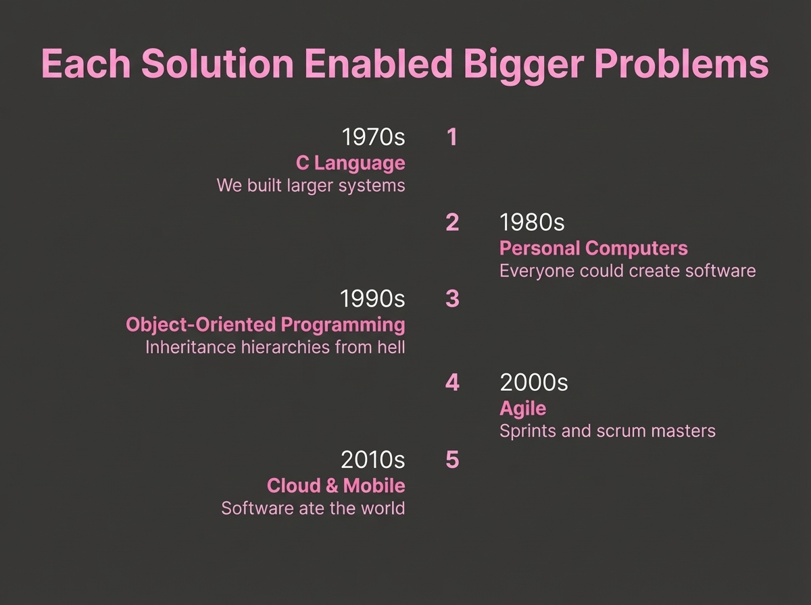

# 2025-11-21-15-00

## Talk
Natalie Serrino (Gimlet Labs) - AI-Generated Kernels

## Session
[Natalie Serrino - Gimlet Labs](../2025-11-21/11-21-14-45-natalie-serrino-gimlet-labs.md)

## Literal Content
- Title: "Each Solution Enabled Bigger Problems"
- Timeline progression:
  1. 1970s - C Language: "We built larger systems"
  2. 1980s - Personal Computers: "Everyone could create software"
  3. 1990s - Object-Oriented Programming: "Inheritance hierarchies from hell"
  4. 2000s - Agile: "Sprints and scrum masters"
  5. 2010s - Cloud & Mobile: "Software ate the world"

## Key Point
Shows the historical pattern where each technological innovation in software development enabled solving progressively larger and more complex problems, setting up context for how AI represents the next evolution.
