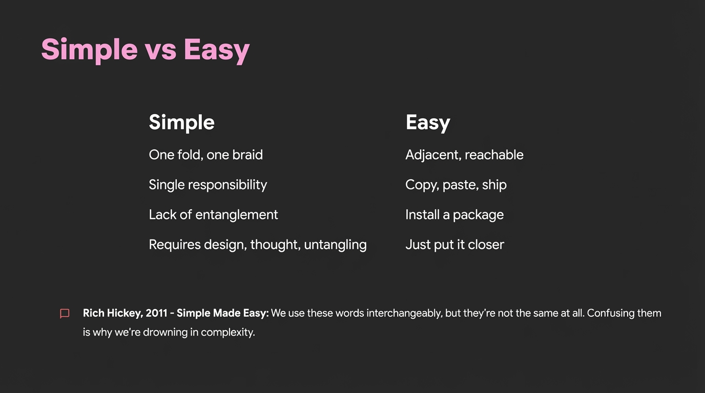

# 2025-11-21-15-01

## Talk
Natalie Serrino (Gimlet Labs) - AI-Generated Kernels

## Session
[Natalie Serrino - Gimlet Labs](../2025-11-21/11-21-14-45-natalie-serrino-gimlet-labs.md)

## Literal Content
- Title: "Simple vs Easy"
- Two columns comparing:
  - **Simple**: One fold, one braid; Single responsibility; Lack of entanglement; Requires design, thought, untangling
  - **Easy**: Adjacent, reachable; Copy, paste, ship; Install a package; Just put it closer
- Bottom citation: "Rich Hickey, 2011 - Simple Made Easy: We use these words interchangeably, but they're not the same at all. Confusing them is why we're drowning in complexity."

## Key Point
Distinguishes between "simple" (architecturally clean, untangled) and "easy" (convenient, quick to implement), arguing that confusing these concepts leads to complexity debt in software systems.
