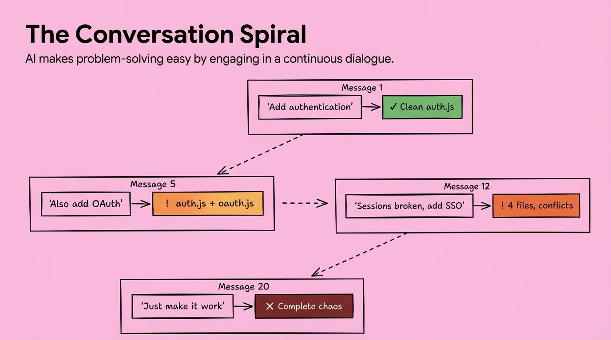

# 2025-11-21-15-03

## Talk
Jake Nations (Netflix) - Infinite Software Crisis

## Session
[Jake Nations - Netflix](../2025-11-21/11-21-15-05-jake-nations-netflix.md)

## Literal Content
- Title: "The Conversation Spiral"
- Subtitle: "AI makes problem-solving easy by engaging in a continuous dialogue."
- Diagram showing progression through messages:
  - Message 1: "Add authentication" → "Clean auth.js" (green/success)
  - Message 5: "Also add OAuth" → "! auth.js + oauth.js" (orange/warning)
  - Message 12: "Sessions broken, add SSO" → "! 4 files, conflicts" (orange/warning)
  - Message 20: "Just make it work" → "X Complete chaos" (red/failure)

## Key Point
Illustrates how iterative AI-assisted development can spiral from clean solutions into chaotic complexity when developers keep asking for additions without proper refactoring or architectural planning.
