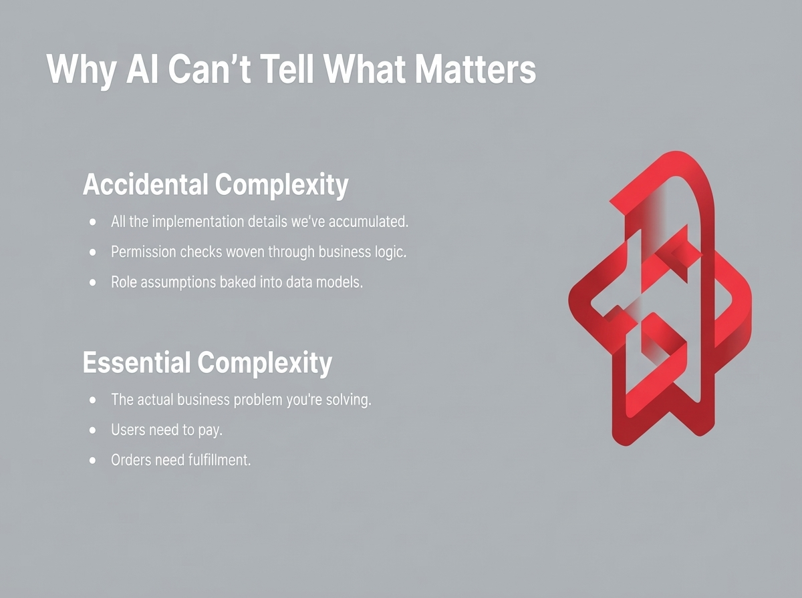

# 2025-11-21-15-05

## Talk
Jake Nations (Netflix) - Infinite Software Crisis

## Session
[Jake Nations - Netflix](../2025-11-21/11-21-15-05-jake-nations-netflix.md)

## Literal Content
- Title: "Why AI Can't Tell What Matters"
- Two sections with red geometric icon:
  - **Accidental Complexity**: All the implementation details we've accumulated; Permission checks woven through business logic; Role assumptions baked into data models
  - **Essential Complexity**: The actual business problem you're solving; Users need to pay; Orders need fulfillment

## Key Point
Distinguishes between essential complexity (core business requirements) and accidental complexity (implementation cruft accumulated over time), arguing that AI struggles to differentiate between what's architecturally necessary versus what's technical debt.
