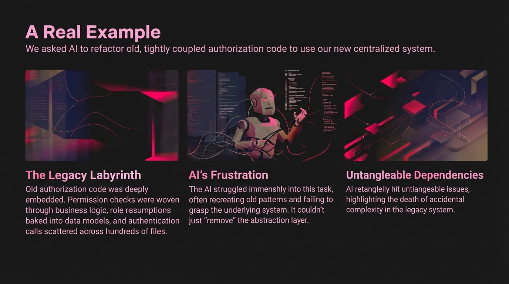

# 2025-11-21-15-06

## Talk
Jake Nations (Netflix) - Infinite Software Crisis

## Session
[Jake Nations - Netflix](../2025-11-21/11-21-15-05-jake-nations-netflix.md)

## Literal Content
- Title: "A Real Example"
- Subtitle: "We asked AI to refactor old, tightly coupled authorization code to use our new centralized system."
- Three sections with stylized images:
  1. **The Legacy Labyrinth**: Old authorization code was deeply embedded. Permission checks were woven through business logic, role assumptions baked into data models, and authentication calls scattered across hundreds of files.
  2. **AI's Frustration**: The AI struggled immensely into this task, often recreating old patterns and failing to grasp the underlying system. It couldn't just "remove" the abstraction layer.
  3. **Untangleable Dependencies**: AI repeatedly hit untangleable issues, highlighting the depth of accidental complexity in the legacy system.

## Key Point
Provides concrete evidence that AI tools struggle with large-scale refactoring tasks involving legacy code because they cannot understand the difference between essential business logic and accumulated technical complexity.
