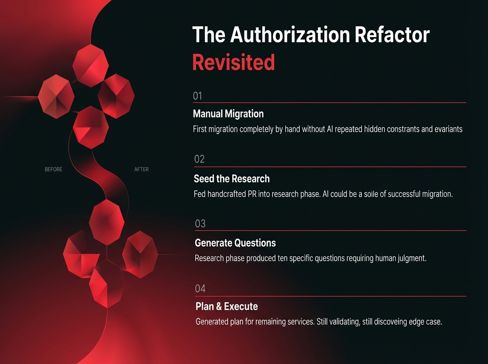

# 2025-11-21-15-12

## Talk
Jake Nations (Netflix) - Infinite Software Crisis

## Session
[Jake Nations - Netflix](../2025-11-21/11-21-15-05-jake-nations-netflix.md)

## Literal Content
- Title: "The Authorization Refactor Revisited"
- Red geometric diagram showing "BEFORE" and "AFTER" transformation
- Four numbered steps:
  1. **Manual Migration**: First migration completely by hand without AI revealed hidden constraints and invariants
  2. **Seed the Research**: Fed handcrafted PR into research phase. AI could use example of successful migration.
  3. **Generate Questions**: Research phase produced ten specific questions requiring human judgment.
  4. **Plan & Execute**: Generated plan for remaining services. Still validating, still discovering edge cases.

## Key Point
Describes a hybrid human-AI approach where humans first manually complete a migration to establish patterns, then use AI to scale that approach to remaining services, demonstrating that AI works best when given high-quality examples and clear constraints.
