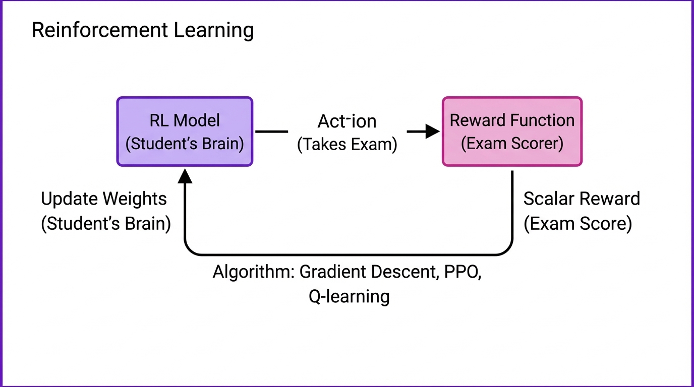

# 2025-11-21-16-19

## Talk
Aparna Dhinakaran (Arize) - System-Prompt Learning

## Session
[Aparna Dhinakaran - Arize](../2025-11-21/11-21-16-00-aparna-dhinakaran-arize.md)

## Literal Content
- Title: "Reinforcement Learning"
- Diagram showing a cycle:
  - "RL Model (Student's Brain)" → "Action (Takes Exam)" → "Reward Function (Exam Scorer)"
  - "Scalar Reward (Exam Score)" feeds back with "Update Weights (Student's Brain)"
- Bottom: "Algorithm: Gradient Descent, PPO, Q-learning"

## Key Point
Explains the reinforcement learning loop using a student-exam metaphor, where the model learns by receiving scalar rewards and updating its weights through optimization algorithms.
