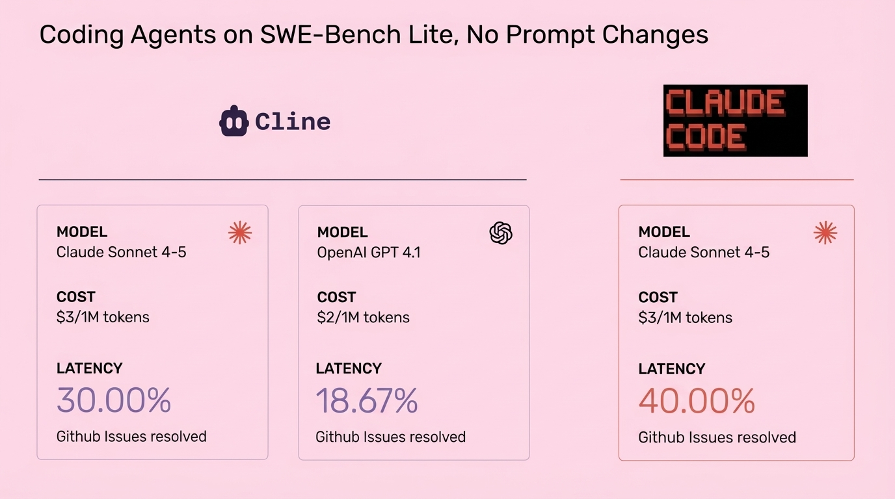

# 2025-11-21-16-21

## Talk
Aparna Dhinakaran (Arize) - System-Prompt Learning

## Session
[Aparna Dhinakaran - Arize](../2025-11-21/11-21-16-00-aparna-dhinakaran-arize.md)

## Literal Content
- Title: "Coding Agents on SWE-Bench Lite, No Prompt Changes"
- Three comparison boxes showing:
  - Cline with Claude Sonnet 4-5: $3/1M tokens, 30.00% GitHub issues resolved
  - OpenAI GPT 4.1: $2/1M tokens, 18.67% GitHub issues resolved
  - Claude Code with Claude Sonnet 4-5: $3/1M tokens, 40.00% GitHub issues resolved
- Claude Code logo in top right

## Key Point
Claude Code outperforms both Cline and GPT-4.1 on the SWE-Bench Lite benchmark, achieving 40% GitHub issue resolution compared to 30% for Cline and 18.67% for GPT-4.1, despite using the same underlying model as Cline.
