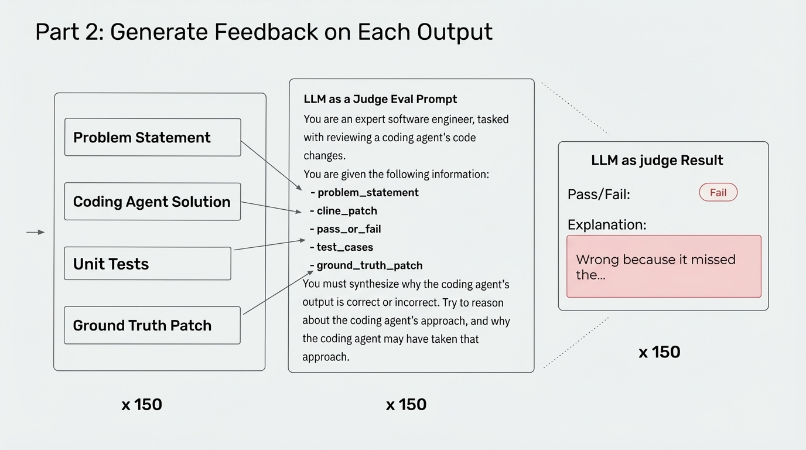

# 2025-11-21-16-23

## Talk
Aparna Dhinakaran (Arize) - System-Prompt Learning

## Session
[Aparna Dhinakaran - Arize](../2025-11-21/11-21-16-00-aparna-dhinakaran-arize.md)

## Literal Content
- Title: "Part 2: Generate Feedback on Each Output"
- Flow showing Problem Statement, Coding Agent Solution, Unit Tests, and Ground Truth Patch feeding into an "LLM as a Judge Eval Prompt"
- The judge prompt reviews code changes given: problem_statement, cline_patch, pass_or_fail, test_cases, ground_truth_patch
- Output shows "LLM as judge Result" with Pass/Fail and Explanation ("Wrong because it missed the...")
- All processes repeated "x 150" times

## Key Point
Describes the second phase where an LLM acts as a judge to evaluate each coding agent's solution, providing reasoned feedback on why solutions are correct or incorrect by comparing against the ground truth.
