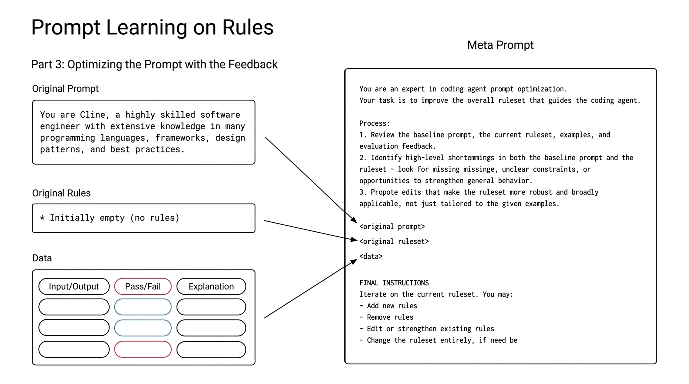

# 2025-11-21-16-24

## Talk
Aparna Dhinakaran (Arize) - System-Prompt Learning

## Session
[Aparna Dhinakaran - Arize](../2025-11-21/11-21-16-00-aparna-dhinakaran-arize.md)

## Literal Content
- Title: "Prompt Learning on Rules"
- Subtitle: "Part 3: Optimizing the Prompt with the Feedback"
- Shows Original Prompt: "You are Cline, a highly skilled software engineer..."
- Original Rules: "Initially empty (no rules)"
- Data section showing Input/Output, Pass/Fail, Explanation examples
- Meta Prompt on right side describing the optimization process with instructions to add/remove/edit/change rules
- All components feed into the optimization process

## Key Point
Demonstrates an automated prompt optimization system where feedback from the 150 test cases is used to iteratively improve the ruleset that guides the coding agent, starting from empty rules and building up based on actual performance data.
