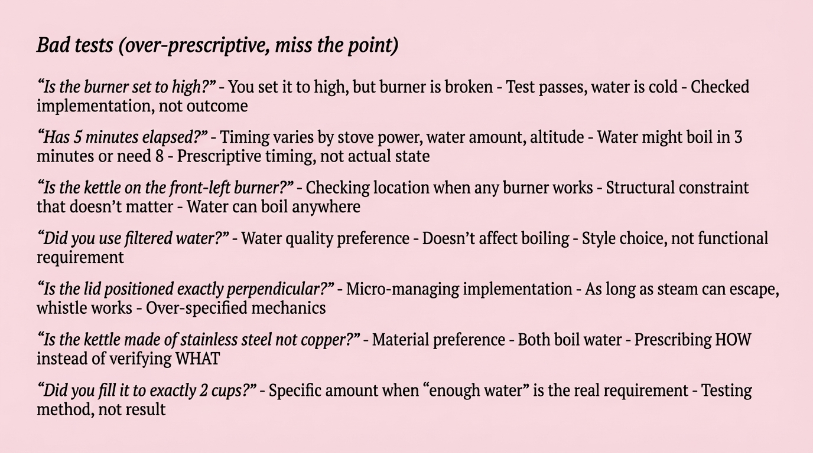

# 2025-11-21-16-36

## Talk
Nik Pash (Cline) - Building Coding Agents

## Session
[Nik Pash - Cline](../2025-11-21/11-21-16-30-nik-pash-cline.md)

## Literal Content
- Title: "Bad tests (over-prescriptive, miss the point)"
- Seven examples of problematic test scenarios using a kettle/water boiling analogy:
  - "Is the burner set to high?" - Tests implementation not outcome
  - "Has 5 minutes elapsed?" - Prescriptive timing vs actual state
  - "Is the kettle on the front-left burner?" - Structural constraint that doesn't matter
  - "Did you use filtered water?" - Style choice, not functional requirement
  - "Is the lid positioned exactly perpendicular?" - Over-specified mechanics
  - "Is the kettle made of stainless steel not copper?" - Prescribing HOW vs WHAT
  - "Did you fill it to exactly 2 cups?" - Testing method, not result

## Key Point
Illustrates common testing anti-patterns by showing how tests can be overly prescriptive, focusing on implementation details rather than the actual functional outcome, which leads to brittle tests that miss the real requirements.
