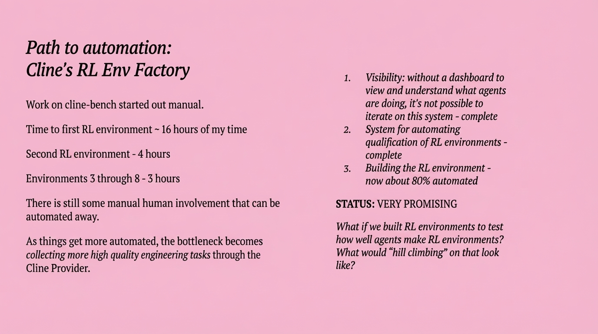

# 2025-11-21-16-37

## Talk
Nik Pash (Cline) - Building Coding Agents

## Session
[Nik Pash - Cline](../2025-11-21/11-21-16-30-nik-pash-cline.md)

## Literal Content
- Title: "Path to automation: Cline's RL Env Factory"
- Left side shows progression:
  - "Work on cline-bench started out manual"
  - "Time to first RL environment ~ 16 hours of my time"
  - "Second RL environment - 4 hours"
  - "Environments 3 through 8 - 3 hours"
  - "There is still some manual human involvement that can be automated away"
  - "As things get more automated, the bottleneck becomes collecting more high quality engineering tasks through the Cline Provider"
- Right side lists points about visibility, system completion, and building automation
- Bottom states: "STATUS: VERY PROMISING"

## Key Point
Chronicles the journey of automating the creation of reinforcement learning environments for Cline, showing dramatic time reductions (from 16 hours to 3 hours) through progressive automation, with about 80% now automated.
