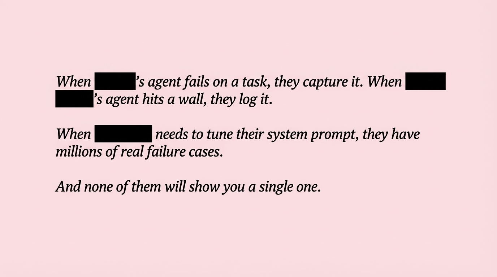

# 2025-11-21-16-38

## Talk
Nik Pash (Cline) - Building Coding Agents

## Session
[Nik Pash - Cline](../2025-11-21/11-21-16-30-nik-pash-cline.md)

## Literal Content
- Three italicized statements with company names redacted (shown as black boxes):
- "When [REDACTED]'s agent fails on a task, they capture it. When [REDACTED]'s agent hits a wall, they log it."
- "When [REDACTED] needs to tune their system prompt, they have millions of real failure cases."
- "And none of them will show you a single one."

## Key Point
Criticizes the lack of transparency in the AI agent industry, pointing out that while companies collect extensive failure data to improve their systems, they don't share these real-world failure cases publicly, creating an information asymmetry.
