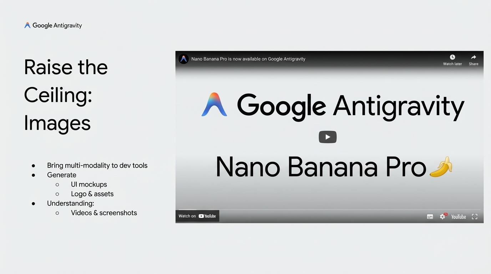

# 2025-11-21-17-13

## Talk
Kevin Hou (Google DeepMind) - Antigravity/Defying Gravity

## Session
[Kevin Hou - Google DeepMind](../2025-11-21/11-21-17-20-kevin-hou-google-deepmind.md)

## Literal Content
- Google Antigravity logo in top left
- Title: "Raise the Ceiling: Images"
- Embedded YouTube video preview showing "Nano Banana Pro" with Google Antigravity branding
- Bullet points listing:
  - Bring multi-modality to dev tools
  - Generate:
    - UI mockups
    - Logo & assets
  - Understanding:
    - Videos & screenshots

## Key Point
Introduction to Google's image generation capabilities (Nano Banana Pro) and how it enables multi-modal development tools for both generating visual assets and understanding visual content.
