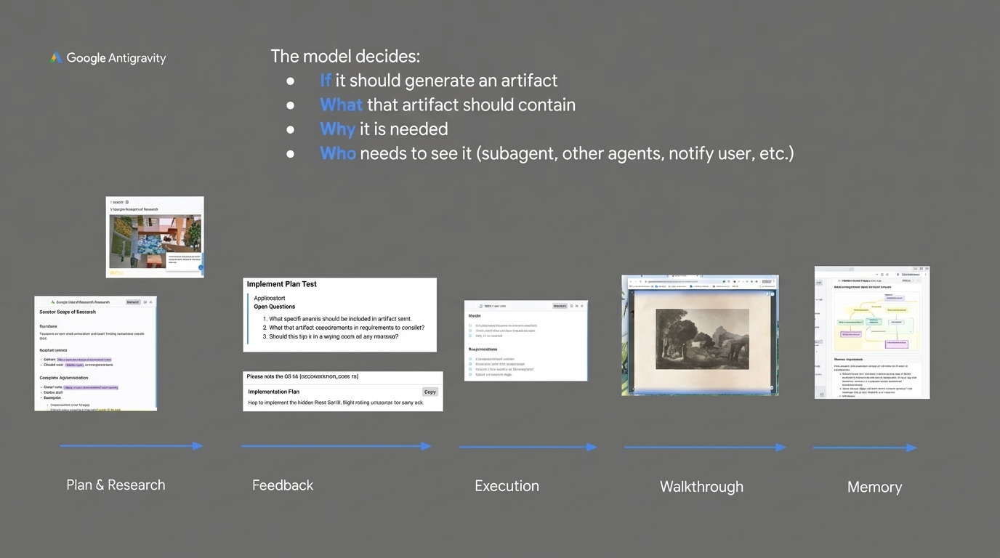

# 2025-11-21-17-17

## Talk
Kevin Hou (Google DeepMind) - Antigravity/Defying Gravity

## Session
[Kevin Hou - Google DeepMind](../2025-11-21/11-21-17-20-kevin-hou-google-deepmind.md)

## Literal Content
- Google Antigravity logo in top left
- Heading: "The model decides:"
  - **If** it should generate an artifact
  - **What** that artifact should contain
  - **Why** it is needed
  - **Who** needs to see it (subagent, other agents, notify user, etc.)
- Bottom section shows a workflow diagram with 5 stages:
  - Plan & Research (showing document screenshots)
  - Feedback (showing implementation plan)
  - Execution (showing requirements)
  - Walkthrough (showing an image)
  - Memory (showing flowchart diagram)
- Blue arrows connecting each stage

## Key Point
Demonstrates an agent-driven artifact generation system where the AI model autonomously decides when to create artifacts, what they contain, why they're needed, and who should see them, following a structured workflow from planning through execution to memory retention.
