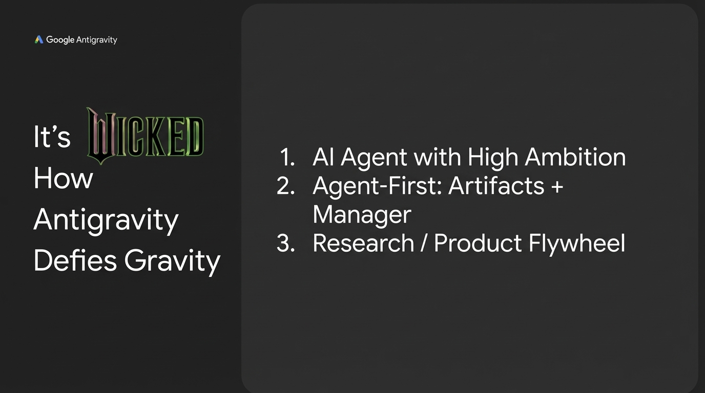

# 2025-11-21-17-26

## Talk
Kevin Hou (Google DeepMind) - Antigravity/Defying Gravity

## Session
[Kevin Hou - Google DeepMind](../2025-11-21/11-21-17-20-kevin-hou-google-deepmind.md)

## Literal Content
- Google Antigravity logo in top left
- Left side heading: "It's WICKED How Antigravity Defies Gravity" (with stylized "WICKED" text)
- Right side numbered list:
  1. AI Agent with High Ambition
  2. Agent-First: Artifacts + Manager
  3. Research / Product Flywheel

## Key Point
Summary slide highlighting three key aspects of the Antigravity platform: ambitious AI agents, an agent-first architecture with artifact management, and a research/product feedback loop that drives continuous improvement.
