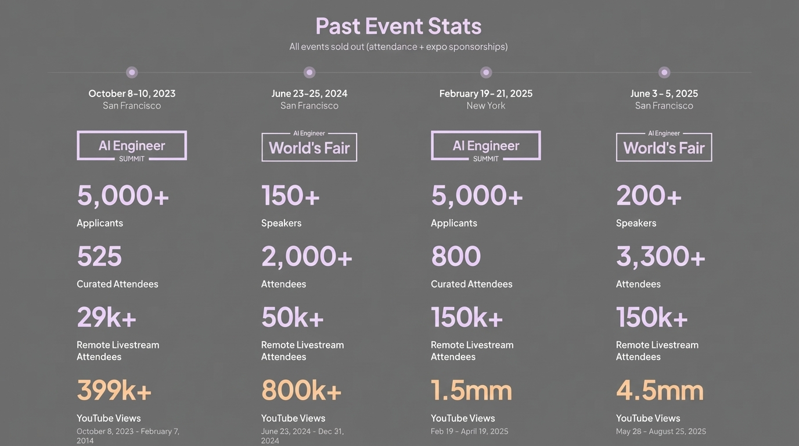

# 2025-11-21-17-30

## Talk
Kevin Hou (Google DeepMind) - Antigravity/Defying Gravity

## Session
[Kevin Hou - Google DeepMind](../2025-11-21/11-21-17-20-kevin-hou-google-deepmind.md)

## Literal Content
- Heading: "Past Event Stats"
- Subtitle: "All events sold out (attendance + expo sponsorships)"
- Timeline showing 4 events:
  - **October 8-10, 2023** (San Francisco) - AI Engineer Summit: 5,000+ Applicants, 525 Curated Attendees, 29k+ Remote Livestream Attendees, 399k+ YouTube Views
  - **June 23-25, 2024** (San Francisco) - World's Fair: 150+ Speakers, 2,000+ Attendees, 50k+ Remote Livestream Attendees, 800k+ YouTube Views
  - **February 19-21, 2025** (New York) - AI Engineer Summit: 5,000+ Applicants, 800 Curated Attendees, 150k+ Remote Livestream Attendees, 1.5mm YouTube Views
  - **June 3-5, 2025** (San Francisco) - World's Fair: 200+ Speakers, 3,300+ Attendees, 150k+ Remote Livestream Attendees, 4.5mm YouTube Views

## Key Point
Showcases the massive growth and success of AI Engineer events, demonstrating increasing scale in applicants, attendees, and reach across both in-person and remote audiences.
