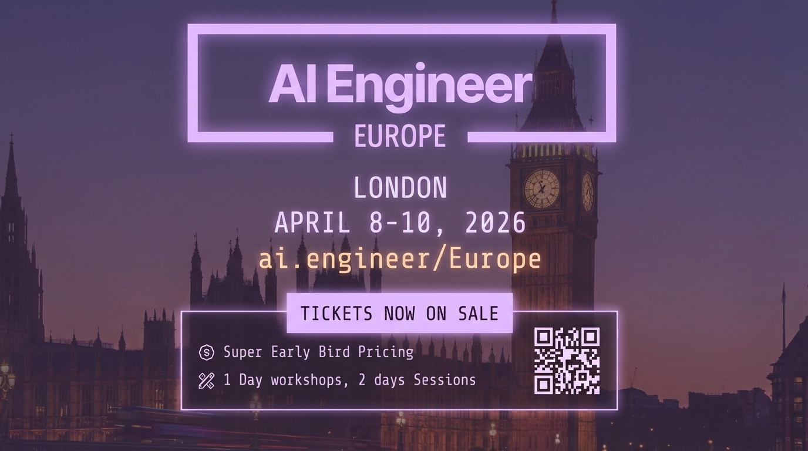

# 2025-11-21-17-34

## Talk
Kevin Hou (Google DeepMind) - Antigravity/Defying Gravity

## Session
[Kevin Hou - Google DeepMind](../2025-11-21/11-21-17-20-kevin-hou-google-deepmind.md)

## Literal Content
- Header: "AI Engineer EUROPE"
- Location: "LONDON"
- Date: "APRIL 8-10, 2026"
- URL: "ai.engineer/Europe"
- "TICKETS NOW ON SALE" (in pink/purple box)
- Details:
  - Super Early Bird Pricing
  - 1 Day workshops, 2 days Sessions
- QR code for ticket purchase
- Background image of London skyline featuring Big Ben at dusk/evening

## Key Point
Advertisement for the first AI Engineer Europe event in London (April 8-10, 2026), promoting super early bird ticket sales with a 3-day event format, expanding the AI Engineer conference series internationally.
